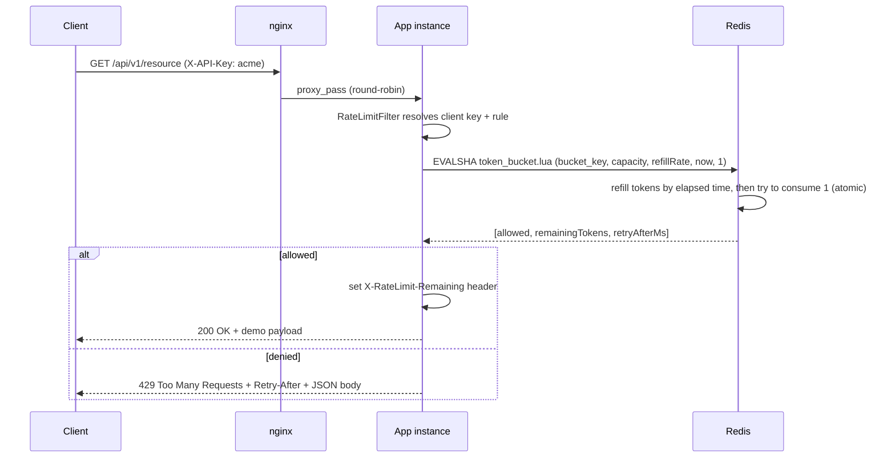

# Distributed Rate Limiter

A distributed, Redis-backed **Token Bucket** rate limiter for Spring Boot — thread-safe and
horizontally scalable across multiple application instances via a single atomic Lua script.

**Measured:** ~**1,000 req/s for 60s** on a single instance (70,010 requests, p95 **19 ms**,
**0%** errors). Raw Gatling report:
[`load-test-results/gatling/sustainedthroughputsimulation-20260818040033152/index.html`](load-test-results/gatling/sustainedthroughputsimulation-20260818040033152/index.html).

## Highlights

- **Atomic distributed quota** — Redis Lua (`EVALSHA`) so concurrent requests across many
  app instances cannot double-allow. A servlet `Filter` at `HIGHEST_PRECEDENCE` rejects
  over-quota traffic before the controller (and before auth, if any).
- **3-instance topology** — Docker Compose runs three identical Spring Boot instances behind
  nginx round-robin; the only shared state is Redis 7.
- **Sustained 1k rps** — Gatling open-model run: 20s ramp + 60s at 1,000 req/s, 200 API keys.
  Sustain phase held ~1,001 req/s. Virtual threads, a pre-warmed Lettuce pool, and Lua SHA
  warmup keep latency flat after ramp-up.
- **Correctness + ops** — `@RateLimit` / YAML per-endpoint overrides, fail-closed Redis
  errors, Testcontainers integration tests, and Gatling burst/throughput/latency simulations.

## Problem statement

A rate limiter that only tracks state in-process (an in-memory counter, a `ConcurrentHashMap`,
etc.) works fine for a single instance, but breaks the moment you scale horizontally: each
instance has its own view of "how many requests has this client made," so a client can get
N× their intended quota just by spreading requests across N app instances. This project
solves that by moving all rate-limit *state* into a single shared Redis, and moving all
rate-limit *logic* into Redis too (as an atomic Lua script) so that no matter which instance
handles a given request, the decision is made against one consistent, race-free source of
truth.

## Architecture


All three app instances are the exact same Docker image, differing only in `SERVER_PORT` /
`INSTANCE_ID`. They share nothing with each other directly — the only shared state is Redis,
and every read-modify-write against that state happens inside one atomic Lua script.

### Request sequence



## Tech stack

Java 21 · Spring Boot 3.3 · Redis 7 (Lua scripting via `EVAL`/`EVALSHA`) · Docker & Docker
Compose · nginx · Maven · Testcontainers + JUnit 5 · Gatling.

## Project layout

```
com.ratelimiter.distributed
├── config/       # Redis config, bean definitions, ratelimiter.* properties, filter wiring
├── controller/   # Demo API (/api/v1/resource, /api/v1/orders) + /api/v1/limiter/status debug endpoint
├── filter/       # RateLimitFilter (OncePerRequestFilter) - the enforcement point
├── service/      # TokenBucketService, ClientKeyResolver, RateLimitRuleResolver
├── model/        # DTOs (RateLimitResult, RateLimitRule, BucketSnapshot, ...)
├── exception/    # RateLimitExceededException + @ControllerAdvice handler
├── annotation/   # @RateLimit per-endpoint override
└── util/         # Lua script loader, Redis key builder, instance identity
```

## How it works

### Token bucket, in one paragraph

Each client (identified by API key, IP, or user id — configurable) gets a bucket with a
`capacity` (max burst size) and a `refillRate` (tokens added per second). Every request tries
to consume 1 token (or more, if `requestedTokens` is set higher). Before checking, the bucket
is topped up based on how much time has passed since it was last touched, capped at
`capacity`. If there's at least 1 token available, the request is allowed and a token is
deducted; otherwise it's rejected with `429` and a `Retry-After` estimate.

### Why a Lua script, not "GET then SET" from Java

The naive implementation — `GET` the current token count in Java, compute the new value,
`SET` it back — has a race condition: if two requests for the same client hit two different
app instances (or even two threads on the same instance) at nearly the same time, both can
read the same "5 tokens remaining," both decide "yes, allowed," and both write back "4
remaining" — silently granting one extra request the bucket should never have allowed. Under
real concurrent load this isn't a rare edge case, it's the default behavior.

The fix is to make "read current state → compute refill → decide → write new state" a single
atomic operation. Redis executes a Lua script to completion before processing any other
command on that connection, so [`token_bucket.lua`](src/main/resources/scripts/token_bucket.lua)
does the entire refill-then-consume decision server-side, in one round trip, with no window
for another caller to interleave. This is what makes the limiter correct across **many app
instances**, not just thread-safe within one JVM.

`TokenBucketService.tryConsume()` executes this script via Spring Data Redis's
`RedisTemplate#execute(RedisScript, ...)`, which transparently uses `EVALSHA` (sending only the
script's SHA1 hash, not its full body) after the first call, falling back to `EVAL` on a
`NOSCRIPT` response — exactly the "cache the SHA" behavior the spec calls for, without any
manual bookkeeping in this codebase.

### Per-endpoint / per-client overrides

Three levels of configuration, most-specific wins:

1. `@RateLimit(capacity = ..., refillRate = ...)` on a controller method (see
   `DemoController#createOrder`)
2. `ratelimiter.endpoints["/some/path"]` in `application.yml`
3. `ratelimiter.default-capacity` / `default-refill-rate` (global fallback)

`RateLimitRuleResolver` merges these and scopes each rule to its own Redis bucket
(`clientKey:scope`), so an endpoint with a tighter override never shares state with the
client's default bucket.

## Configuration reference (`application.yml`)

```yaml
ratelimiter:
  enabled: true
  default-capacity: 50
  default-refill-rate: 10      # tokens/sec
  key-strategy: api-key         # api-key | ip | user-id
  api-key-header: X-API-Key
  excluded-paths:
    - /actuator/health
    - /api/v1/limiter/**
```

High-traffic defaults (all overridable by env): Java 21 virtual threads, Tomcat
`max-connections` / `accept-count` 10,000, Lettuce pool min-idle 64 / max-active 128, 1s
Redis command timeout. Redis connections and `token_bucket.lua` EVALSHA are warmed **before**
Tomcat accepts traffic (`RateLimiterWarmup`).

Redis host/port and pool sizing are environment-variable driven — see `docker-compose.yml` —
so the same image runs unmodified as any of the 3 instances.

## API

| Endpoint | Rate limited? | Notes |
|---|---|---|
| `GET /api/v1/resource` | Yes (global default) | Demo endpoint, mock payload |
| `GET/POST /api/v1/orders` | Yes (`@RateLimit(capacity=20, refillRate=5)`) | Demonstrates per-endpoint override |
| `GET /api/v1/limiter/status?clientKey=...` | No | Peeks a client's current bucket state (read-only, never consumes a token) |
| `GET /api/v1/limiter/instance` | No | Returns which instance served the request |
| `GET /actuator/health` | No | Standard Spring Boot health check |

A denied request gets:

```http
HTTP/1.1 429 Too Many Requests
Retry-After: 1
X-RateLimit-Limit: 50
X-RateLimit-Remaining: 0

{"error":"RATE_LIMIT_EXCEEDED","message":"Rate limit exceeded. Try again later.","retryAfterMs":972,"remainingTokens":0,"status":429}
```

## How to run

### Just the app, against local Redis

```bash
docker compose up -d redis
./mvnw spring-boot:run
curl -H "X-API-Key: demo" http://localhost:8080/api/v1/resource
```

### Full distributed topology (Redis + 3 instances + nginx)

```bash
docker compose up --build
# nginx listens on :8080 and round-robins across app-instance-1/2/3 (:8081-8083 also exposed directly)

# Prove the shared global limit survives being spread across instances:
./scripts/verify-distributed-limit.sh http://localhost:8080 80
```

`verify-distributed-limit.sh` fires repeated requests with one client key through nginx,
prints which instance served each one (proving load balancing), and confirms the client still
gets a `429` once its shared bucket is exhausted — regardless of which instance actually
handled any individual request.

### Tests

```bash
./mvnw test   # unit + Testcontainers integration tests (needs Docker)
```

In a Docker-less environment, the same suite can point at an already-running Redis instead:

```bash
./mvnw test -DEXTERNAL_REDIS_HOST=localhost -DEXTERNAL_REDIS_PORT=6379
```

### Load tests

```bash
# Headline 1k rps / 60s sustain run:
./mvnw gatling:test -Dgatling.simulationClass=simulations.SustainedThroughputSimulation \
    -Dbase.url=http://localhost:8080 -Dtarget.rps=1000 -Dramp.seconds=20 -Dsustain.seconds=60

./mvnw gatling:test -Dgatling.simulationClass=simulations.BurstSimulation -Dbase.url=http://localhost:8080
./mvnw gatling:test -Dgatling.simulationClass=simulations.LatencyUnderConcurrencySimulation -Dbase.url=http://localhost:8080
```

Reports land in `load-test-results/gatling/<simulation>-<timestamp>/`. Open `index.html`.

## Load test results

Real numbers — see [`load-test-results/README.md`](load-test-results/README.md) for environment,
caveats, and the HTML reports.

| Scenario | Throughput | Mean | p95 | p99 | Errors |
|---|---|---|---|---|---|
| **A — 1k rps sustain (60s)** | **~1,001 req/s** in the 60s sustain window (70,010 / 70,010; 875 req/s mean including 20s ramp) | **9 ms** | **19 ms** | **42 ms** | **0%** |
| B — Burst past capacity (50) | 63 allowed / 237 denied, first 429 at request #53 | — | — | — | 0% |
| C — Latency under concurrency (30 users, closed model, same-host Redis) | 33,128 req/s | 1 ms | 2 ms | 4 ms | 0% |

**Headline report (Scenario A):**
[`load-test-results/gatling/sustainedthroughputsimulation-20260818040033152/index.html`](load-test-results/gatling/sustainedthroughputsimulation-20260818040033152/index.html)

Scenario A was a **single Spring Boot instance** with **Redis 7 in Docker** (Windows). 200
distinct `X-API-Key` tenants so the test measures limiter throughput, not one client's 10
token/s refill. One key is still capped at `default-capacity=50` / `default-refill-rate=10`.
The 3-instance + nginx topology was not this 1k run — re-run with `-Dbase.url=http://localhost:8080`
after `docker compose up --build` for that number.

Scenario C (and an older ~500 rps / 1 ms Scenario A) were captured against **same-host Redis
with no Docker hop**; see the load-test README.

## Design decisions & trade-offs

- **Lua script vs. distributed lock vs. `WATCH`/`MULTI`**: a Redis lock (e.g. Redlock) would
  work but adds a second round trip (acquire, then act, then release) and a whole new failure
  mode (lock expiry vs. operation duration). `WATCH`/`MULTI` optimistic transactions would need
  a retry loop under contention. A single Lua script gets atomicity in exactly one round trip
  with no retry logic needed — simpler and faster.
- **Token bucket vs. sliding window / fixed window**: fixed windows have a boundary problem
  (2x burst possible right at a window edge). Sliding window log/counter is more precise but
  needs more memory per key (a log of timestamps) or more approximation. Token bucket gives a
  clean, well-understood burst allowance (`capacity`) plus a steady-state rate (`refillRate`)
  with O(1) state per client (two fields in a hash) — the right trade-off for an API gateway
  use case.
- **Scoping buckets by `clientKey:scope` rather than just `clientKey`**: without this, a
  per-endpoint override with a different `capacity` would read/write the *same* Redis hash as
  the client's global-default bucket, corrupting both. Scoping by rule keeps overrides
  isolated without needing a separate Redis key namespace per feature.
- **Fail-closed, not fail-open, on Redis errors**: if the Lua script call itself fails
  unexpectedly, `TokenBucketService` denies the request rather than allowing it through
  unchecked. For a component whose entire job is protecting shared infrastructure from abuse,
  "reject on uncertainty" is the safer default than "allow on uncertainty" — the trade-off is
  Redis becoming a single point of failure for availability, which the "Future improvements"
  section below addresses.
- **Filter registered at `Ordered.HIGHEST_PRECEDENCE`, not a `HandlerInterceptor`**: an
  interceptor only runs once Spring MVC has resolved a handler, which in a real deployment
  would be *after* any Spring Security filter chain. Registering as a servlet `Filter` at the
  very front lets abusive traffic get rejected before it pays the cost of authentication at
  all — matching the spec's "before auth, if any" requirement even though this demo has no
  auth layer to actually order against.

## Future improvements

- **Redis Cluster / Sentinel** instead of a single Redis node, for HA — a single Redis is a
  single point of failure for the whole rate limiter today.
- **Admin API for dynamic per-endpoint config** so limits can be tuned without a redeploy
  (currently `ratelimiter.endpoints` is static YAML).
- **Circuit breaker around the Redis call** so a Redis outage degrades gracefully (e.g.
  fail-open with alerting, rather than a hard fail-closed that takes down every protected
  endpoint) instead of the current all-or-nothing fail-closed behavior.
- **Distributed tracing** (e.g. a trace id propagated through nginx → app → Redis call) to
  make the sequence diagram above something you can actually observe per-request in production.

## License

MIT — see [LICENSE](LICENSE).
