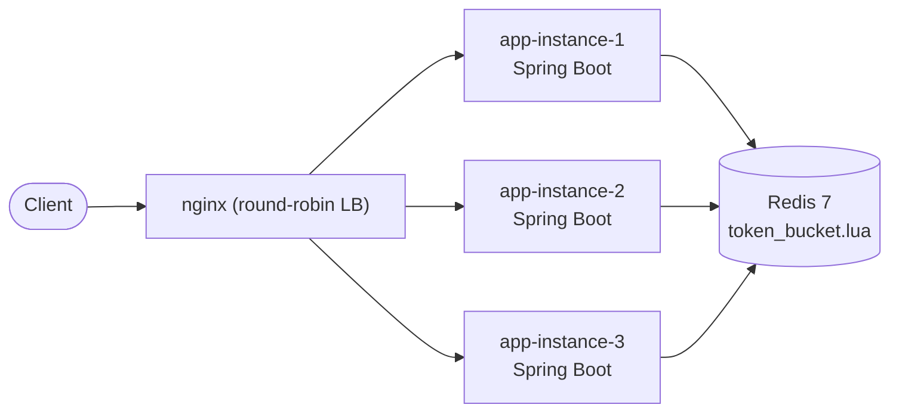
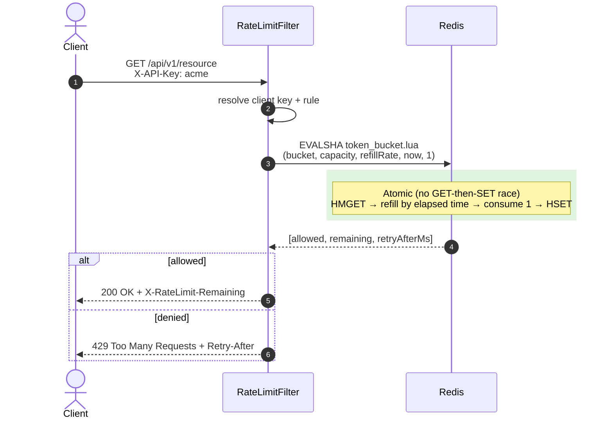
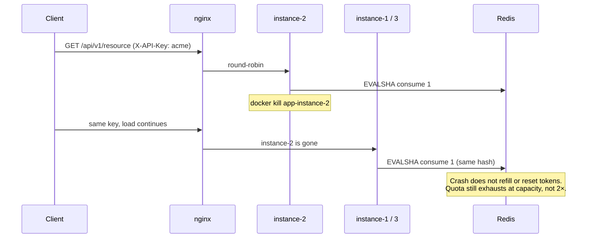

# throttlr

A Redis-backed, atomic token-bucket limiter for multi-instance Spring Boot apps.

Distributed, thread-safe, and horizontally scalable: every allow/deny is one Redis Lua
script (`EVALSHA`), so N instances share one quota instead of N copies of it.

**Measured (Gatling stats table, not a rounded claim):** **70,010 / 70,010** OK, **864.32 req/s**
mean (Cnt/s), p95 **10 ms**, **0** KO —
[`load-test-results/gatling/sustainedthroughputsimulation-20260818172653414/index.html`](load-test-results/gatling/sustainedthroughputsimulation-20260818172653414/index.html).
Cnt/s includes the 20s ramp; the same report’s **Requests / sec** chart is the sustain plateau
(~1,000 after `-Dtarget.rps=1000`). Tenant count is `TENANT_POOL_SIZE` in
[`SustainedThroughputSimulation.java`](src/test/java/simulations/SustainedThroughputSimulation.java)
(default **200**), not a field Gatling prints.

## Highlights

- **Atomic distributed quota** — Redis Lua (`EVALSHA`) so concurrent requests across many
  app instances cannot double-allow. A servlet `Filter` at `HIGHEST_PRECEDENCE` rejects
  over-quota traffic before the controller (and before auth, if any).
- **3-instance topology** — Docker Compose runs three identical Spring Boot instances behind
  nginx round-robin; the only shared state is Redis 7. Kill instance 2 mid-load: the shared
  bucket still exhausts at ~capacity, not 2× (see [Failure case](#failure-case-kill-an-instance-mid-load)).
- **Load (verbatim from the Gatling stats table)** — 70,010 / 70,010 OK, Cnt/s **864.32**,
  p95 **10 ms**, 0 KO. Open-model [`SustainedThroughputSimulation`](src/test/java/simulations/SustainedThroughputSimulation.java)
  (`target.rps` default **1000**, `TENANT_POOL_SIZE` default **200**). The ~1,000 plateau is
  the **Requests / sec** chart in that HTML, not the Cnt/s cell.
- **Correctness + ops** — `@RateLimit` / YAML per-endpoint overrides, fail-closed Redis
  errors, Testcontainers integration tests, and Gatling burst/throughput/latency simulations.

## Problem statement

A rate limiter that only tracks state in-process (an in-memory counter, a `ConcurrentHashMap`,
etc.) works fine for a single instance, but breaks the moment you scale horizontally: each
instance has its own view of "how many requests has this client made," so a client can get
N× their intended quota just by spreading requests across N app instances. This project
solves that by moving all rate-limit *state* into a single shared Redis, and moving all
rate-limit *logic* into Redis too (as an atomic Lua script) so that no matter which instance
handles a given request, the decision is made against one consistent, race-free source of
truth.

## Architecture



All three app instances are the exact same Docker image, differing only in `SERVER_PORT` /
`INSTANCE_ID`. They share nothing with each other directly — the only shared state is Redis,
and every read-modify-write against that state happens inside one atomic Lua script.

### Atomic request path

One round trip. Redis runs the Lua script to completion before any other command on
that key can run — so two app instances cannot both consume the last token.



### Failure case: kill an instance mid-load

This is the case a naive limiter gets wrong. In-memory counters (even behind sticky
sessions) reset when a node dies: the client lands on a surviving instance and receives a
**fresh** bucket. throttlr does not — the bucket lives in Redis, not in the JVM that crashed.



```bash
docker compose up --build -d
./scripts/verify-failover-quota.sh http://localhost:8080 20 80
# Windows: .\scripts\verify-failover-quota.ps1 http://localhost:8080 20 80
```

The script sends 20 requests through nginx (you should see all three `servedByInstance`
values), **`docker kill`s `app-instance-2`**, then keeps going until the shared bucket
trips `429`. Pass = 200s stay under `capacity + refill×elapsed` (not ~2× capacity), no 200s
from the dead instance, and 429s still happen. A few nginx 502s right after the kill are
expected; they are not extra quota. The container is started again at the end.

## Tech stack

Java 21 · Spring Boot 3.3 · Redis 7 (Lua scripting via `EVAL`/`EVALSHA`) · Docker & Docker
Compose · nginx · Maven · Testcontainers + JUnit 5 · Gatling.

## Project layout

```
com.ratelimiter.distributed
├── config/       # Redis config, bean definitions, ratelimiter.* properties, filter wiring
├── controller/   # Demo API (/api/v1/resource, /api/v1/orders) + /api/v1/limiter/status debug endpoint
├── filter/       # RateLimitFilter (OncePerRequestFilter) - the enforcement point
├── service/      # TokenBucketService, ClientKeyResolver, RateLimitRuleResolver
├── model/        # DTOs (RateLimitResult, RateLimitRule, BucketSnapshot, ...)
├── exception/    # RateLimitExceededException + @ControllerAdvice handler
├── annotation/   # @RateLimit per-endpoint override
└── util/         # Lua script loader, Redis key builder, instance identity
```

## How it works

### Token bucket, in one paragraph

Each client (identified by API key, IP, or user id — configurable) gets a bucket with a
`capacity` (max burst size) and a `refillRate` (tokens added per second). Every request tries
to consume 1 token (or more, if `requestedTokens` is set higher). Before checking, the bucket
is topped up based on how much time has passed since it was last touched, capped at
`capacity`. If there's at least 1 token available, the request is allowed and a token is
deducted; otherwise it's rejected with `429` and a `Retry-After` estimate.

### Why Lua / `EVALSHA` — not a Redis transaction, and not in-memory + sticky sessions

`GET` then `SET` from Java is racy: two instances can both read "1 token left" and both
allow. `WATCH`/`MULTI` fixes that only with a retry loop, and under contention (the exact
moment a bucket is almost empty) those retries stampede. A distributed lock (Redlock) adds a
second round trip and a new failure mode — lock TTL vs. script duration. **In-memory counters
plus sticky sessions** look simpler and avoid Redis, but they are a correctness bug dressed
as an architecture: a deploy, scale-out, or `docker kill` moves the client onto a JVM whose
map is empty, so they get a full burst again; stickiness also dies with the node. Lua is the
boring trade-off that actually holds: Redis runs
[`token_bucket.lua`](src/main/resources/scripts/token_bucket.lua) to completion before any
other command, so refill + consume + write is **one round trip, no retries, no affinity**.
`EVALSHA` (via `RedisTemplate#execute(RedisScript, ...)`) sends the SHA after the first load
instead of the script body on every request; `NOSCRIPT` falls back to `EVAL`. That is why
killing instance 2 mid-load does not reset anyone's quota.

### Per-endpoint / per-client overrides

Three levels of configuration, most-specific wins:

1. `@RateLimit(capacity = ..., refillRate = ...)` on a controller method (see
   `DemoController#createOrder`)
2. `ratelimiter.endpoints["/some/path"]` in `application.yml`
3. `ratelimiter.default-capacity` / `default-refill-rate` (global fallback)

`RateLimitRuleResolver` merges these and scopes each rule to its own Redis bucket
(`clientKey:scope`), so an endpoint with a tighter override never shares state with the
client's default bucket.

## Configuration reference (`application.yml`)

```yaml
ratelimiter:
  enabled: true
  default-capacity: 50
  default-refill-rate: 10      # tokens/sec
  key-strategy: api-key         # api-key | ip | user-id
  api-key-header: X-API-Key
  excluded-paths:
    - /actuator/health
    - /api/v1/limiter/**
```

High-traffic defaults (all overridable by env): Java 21 virtual threads, Tomcat
`max-connections` / `accept-count` 10,000, Lettuce pool min-idle 64 / max-active 128, 1s
Redis command timeout. Redis connections and `token_bucket.lua` EVALSHA are warmed **before**
Tomcat accepts traffic (`RateLimiterWarmup`).

Redis host/port and pool sizing are environment-variable driven — see `docker-compose.yml` —
so the same image runs unmodified as any of the 3 instances.

## API

| Endpoint | Rate limited? | Notes |
|---|---|---|
| `GET /api/v1/resource` | Yes (global default) | Demo endpoint, mock payload |
| `GET/POST /api/v1/orders` | Yes (`@RateLimit(capacity=20, refillRate=5)`) | Demonstrates per-endpoint override |
| `GET /api/v1/limiter/status?clientKey=...` | No | Peeks a client's current bucket state (read-only, never consumes a token) |
| `GET /api/v1/limiter/instance` | No | Returns which instance served the request |
| `GET /actuator/health` | No | Standard Spring Boot health check |

A denied request gets:

```http
HTTP/1.1 429 Too Many Requests
Retry-After: 1
X-RateLimit-Limit: 50
X-RateLimit-Remaining: 0

{"error":"RATE_LIMIT_EXCEEDED","message":"Rate limit exceeded. Try again later.","retryAfterMs":972,"remainingTokens":0,"status":429}
```

## How to run

### Just the app, against local Redis

```bash
docker compose up -d redis
./mvnw spring-boot:run
curl -H "X-API-Key: demo" http://localhost:8080/api/v1/resource
```

### Full distributed topology (Redis + 3 instances + nginx)

```bash
docker compose up --build
# nginx listens on :8080 and round-robins across app-instance-1/2/3 (:8081-8083 also exposed directly)

# Prove the shared global limit survives being spread across instances:
./scripts/verify-distributed-limit.sh http://localhost:8080 80

# Prove the quota still holds when a node dies mid-load:
./scripts/verify-failover-quota.sh http://localhost:8080 20 80
```

`verify-distributed-limit.sh` fires repeated requests with one client key through nginx,
prints which instance served each one (proving load balancing), and confirms the client still
gets a `429` once its shared bucket is exhausted — regardless of which instance actually
handled any individual request.

`verify-failover-quota.sh` (PowerShell: `verify-failover-quota.ps1`) does the same **and**
`docker kill`s `app-instance-2` after 20 requests. Remaining nodes keep spending the Redis
hash; the client does not get a second full burst.

### Tests

```bash
./mvnw test   # unit + Testcontainers integration tests (needs Docker)
```

In a Docker-less environment, the same suite can point at an already-running Redis instead:

```bash
./mvnw test -DEXTERNAL_REDIS_HOST=localhost -DEXTERNAL_REDIS_PORT=6379
```

### Load tests

```bash
# Headline 1k rps / 60s sustain run:
./mvnw gatling:test -Dgatling.simulationClass=simulations.SustainedThroughputSimulation \
    -Dbase.url=http://localhost:8080 -Dtarget.rps=1000 -Dramp.seconds=20 -Dsustain.seconds=60

./mvnw gatling:test -Dgatling.simulationClass=simulations.BurstSimulation -Dbase.url=http://localhost:8080
./mvnw gatling:test -Dgatling.simulationClass=simulations.LatencyUnderConcurrencySimulation -Dbase.url=http://localhost:8080
```

Reports land in `load-test-results/gatling/<simulation>-<timestamp>/`. Open `index.html`.

## Load test results

Real numbers — see [`load-test-results/README.md`](load-test-results/README.md) for environment,
caveats, and the HTML reports.

| Scenario | What Gatling printed | Mean | p95 | p99 | Errors |
|---|---|---|---|---|---|
| **A — open-model sustain** | **70,010 / 70,010** OK, Cnt/s **864.32** (ramp included). Offered: `-Dtarget.rps=1000` for 60s after a 20s ramp — plateau is the report’s Requests/sec chart | **5 ms** | **10 ms** | **19 ms** | **0%** |
| B — Burst past capacity (50) | 63 allowed / 237 denied, first 429 at request #53 | — | — | — | 0% |
| C — Latency under concurrency (30 users, closed model, same-host Redis) | 33,128 req/s | 1 ms | 2 ms | 4 ms | 0% |

**Headline report (Scenario A):**
[`load-test-results/gatling/sustainedthroughputsimulation-20260818172653414/index.html`](load-test-results/gatling/sustainedthroughputsimulation-20260818172653414/index.html)

#### How Scenario A was measured (every number has a file)

Source: [`src/test/java/simulations/SustainedThroughputSimulation.java`](src/test/java/simulations/SustainedThroughputSimulation.java).
Raw report: [`…/sustainedthroughputsimulation-20260818172653414/index.html`](load-test-results/gatling/sustainedthroughputsimulation-20260818172653414/index.html)
(Stats table: Total **70010**, OK **70010**, KO **0**, Cnt/s **864.32**, 95th pct **10**, mean **5**).

| Claim | Where it lives |
|---|---|
| 70,010 / 70,010, 0 KO, Cnt/s 864.32, p95 10 ms | Gatling **Stats** table in that `index.html` |
| ~1,000 rps after ramp | Same HTML, **Requests / sec** chart — *not* the Cnt/s cell (Cnt/s averages in the 20s ramp) |
| 200 tenants | `TENANT_POOL_SIZE` in the simulation (default 200). Gatling does not print tenant count |
| Offered 1,000 rps | `-Dtarget.rps=1000` (class default is now 1000). Per-key cap is still 50 burst / 10 tokens/s |
| Success | HTTP **200 and 429** both pass the check; KO = 5xx / connection errors |
| Topology | 1 Spring Boot instance + Redis 7 in Docker Desktop (Windows) |
| Reproduce | `./mvnw gatling:test -Dgatling.simulationClass=simulations.SustainedThroughputSimulation -Dbase.url=http://127.0.0.1:8080 -Dtarget.rps=1000 -Dramp.seconds=20 -Dsustain.seconds=60` |

The 3-instance + nginx topology was not this 1k run — re-run with `-Dbase.url=http://localhost:8080`
after `docker compose up --build` for that number. Scenario C (and an older ~500 rps / 1 ms
Scenario A) used **same-host Redis with no Docker hop**; see the load-test README.

## Design decisions & trade-offs

- **Lua / `EVALSHA` vs. `WATCH`/`MULTI` vs. in-memory + sticky sessions**: a Redis lock
  (e.g. Redlock) would work but adds a second round trip and a lock-TTL failure mode.
  `WATCH`/`MULTI` needs a retry loop that storms when the bucket is almost empty. Sticky
  in-memory counters avoid Redis until a node dies or a deploy moves the client — then the
  quota silently resets (see [Failure case](#failure-case-kill-an-instance-mid-load)). Lua is
  one round trip, no retries, no affinity.
- **Token bucket vs. sliding window / fixed window**: fixed windows have a boundary problem
  (2x burst possible right at a window edge). Sliding window log/counter is more precise but
  needs more memory per key (a log of timestamps) or more approximation. Token bucket gives a
  clean, well-understood burst allowance (`capacity`) plus a steady-state rate (`refillRate`)
  with O(1) state per client (two fields in a hash) — the right trade-off for an API gateway
  use case.
- **Scoping buckets by `clientKey:scope` rather than just `clientKey`**: without this, a
  per-endpoint override with a different `capacity` would read/write the *same* Redis hash as
  the client's global-default bucket, corrupting both. Scoping by rule keeps overrides
  isolated without needing a separate Redis key namespace per feature.
- **Fail-closed, not fail-open, on Redis errors**: if the Lua script call itself fails
  unexpectedly, `TokenBucketService` denies the request rather than allowing it through
  unchecked. For a component whose entire job is protecting shared infrastructure from abuse,
  "reject on uncertainty" is the safer default than "allow on uncertainty" — the trade-off is
  Redis becoming a single point of failure for availability, which the "Future improvements"
  section below addresses.
- **Filter registered at `Ordered.HIGHEST_PRECEDENCE`, not a `HandlerInterceptor`**: an
  interceptor only runs once Spring MVC has resolved a handler, which in a real deployment
  would be *after* any Spring Security filter chain. Registering as a servlet `Filter` at the
  very front lets abusive traffic get rejected before it pays the cost of authentication at
  all — matching the spec's "before auth, if any" requirement even though this demo has no
  auth layer to actually order against.

## Future improvements

- **Redis Cluster / Sentinel** instead of a single Redis node, for HA — a single Redis is a
  single point of failure for the whole rate limiter today.
- **Admin API for dynamic per-endpoint config** so limits can be tuned without a redeploy
  (currently `ratelimiter.endpoints` is static YAML).
- **Circuit breaker around the Redis call** so a Redis outage degrades gracefully (e.g.
  fail-open with alerting, rather than a hard fail-closed that takes down every protected
  endpoint) instead of the current all-or-nothing fail-closed behavior.
- **Distributed tracing** (e.g. a trace id propagated through nginx → app → Redis call) to
  make the sequence diagram above something you can actually observe per-request in production.

## License

MIT — see [LICENSE](LICENSE).
